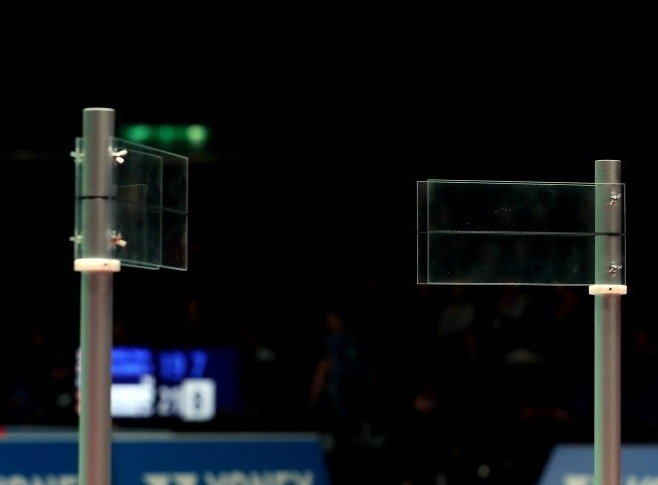
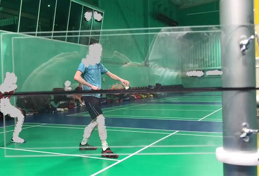
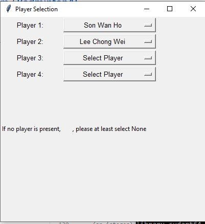

### For a more generic view on how to deploy this code, please go to [this link](https://github.com/Haosam/BadmintonAI/blob/master/Yolov3_deepsort/README.md) and read through the readme

# Badminton Service
Badminton has been a long standing sport since it was first played in 1860s. We have seen badminton greats from Rudy Hartono, to Peter Gade and the legendary battles between Lee Chong Wei and Lin Dan during their long spanning careers, to superstars like Kento Momota.  
In recent times, technology has started to play a part in current badminton such as the Hawkeye where players are given chances to challenge line calls made by line judges against their favour. The usage of such cameras has allowed players to have a more equal playing chance on the court.  
  
Badminton service has been an issue during matches since the new ruling of the shuttlecock must be 1.15 metres off the ground when serving.  
There are service judges sitting at the side with the following equipment below  
\
\
And this is an example of the view they see\
 

During this period of Covid-19, many sports events have been cancelled and badminton likewise has been affected. I decided to try and aid referees in determining whether players have adhered to the service rules, (and trying to attempt to reduce the amount of people at a specific location, while trying to enable them to measure 1.15m as accurately as possible,) using the YOLO algorithm through Machine Learning and Basic Python Programming.\
\
The following are the results  
\
Demo of 1.15m Service Line on Lee Chong Wei vs Son Wan Ho taken by [Shuttle Amazing](https://www.youtube.com/channel/UC3oV6PiHq4QzxFefiUSbcnw)
\
\
Demo of 1.15m Service Line on Macau Open 2018 taken by [JyinLaw](https://www.youtube.com/channel/UC_4Qnq-oTiOWdTl64YmNQ-A/featured)

# How to deploy this repository?
This repository implements YOLOv3 and Deep SORT in order to perfrom real-time object tracking. Yolov3 is an algorithm that uses deep convolutional neural networks to perform object detection. We can feed these object detections into Deep SORT (Simple Online and Realtime Tracking with a Deep Association Metric) in order for a real-time object tracker to be created. It also draws a line 1.15m respective to the ground the ensure that the player does not break the service rules
## Getting started

#### Conda (Recommended)

```bash
# Tensorflow CPU
conda env create -f conda-cpu.yml
conda activate tracker-cpu

# Tensorflow GPU
conda env create -f conda-gpu.yml
conda activate tracker-gpu
```

#### Pip
```bash
# TensorFlow CPU
pip install -r requirements.txt

# TensorFlow GPU
pip install -r requirements-gpu.txt
```

### Nvidia Driver (For GPU, if you haven't set it up already)
```bash
# Ubuntu 18.04
sudo add-apt-repository ppa:graphics-drivers/ppa
sudo apt install nvidia-driver-430
# Windows/Other
https://www.nvidia.com/Download/index.aspx
```
### Downloading official pretrained weights
For Linux: Let's download official yolov3 weights pretrained on COCO dataset. 

```
# yolov3
wget https://pjreddie.com/media/files/yolov3.weights -O weights/yolov3.weights

# yolov3-tiny
wget https://pjreddie.com/media/files/yolov3-tiny.weights -O weights/yolov3-tiny.weights
```
For Windows:
You can download the yolov3 weights by clicking [here](https://pjreddie.com/media/files/yolov3.weights) and yolov3-tiny [here](https://pjreddie.com/media/files/yolov3-tiny.weights) then save them to the weights folder.

### Using Custom trained weights
<strong> Learn How To Train Custom YOLOV3 Weights Here: https://www.youtube.com/watch?v=zJDUhGL26iU </strong>

Add your custom weights file to weights folder and your custom .names file into data/labels folder.
  
### Saving your yolov3 weights as a TensorFlow model.
Load the weights using `load_weights.py` script. This will convert the yolov3 weights into TensorFlow .tf model files!

```
# yolov3
python load_weights.py

# yolov3-tiny
python load_weights.py --weights ./weights/yolov3-tiny.weights --output ./weights/yolov3-tiny.tf --tiny

# yolov3-custom (add --tiny flag if your custom weights were trained for tiny model)
python load_weights.py --weights ./weights/<YOUR CUSTOM WEIGHTS FILE> --output ./weights/yolov3-custom.tf --num_classes <# CLASSES>
```

After executing one of the above lines, you should see proper .tf files in your weights folder. You are now ready to run object tracker.
To obtain my custom trained yolo weights, please use this [link](https://drive.google.com/file/d/1oOchR-VzftixTF09w-E3aTvkt6bG8XmB/view?usp=sharing)

## Running the Object Tracker
Now you can run the object tracker for whichever model you have created, pretrained, tiny, or custom.
```
# For the badminton tracker we are using a yolov3 custom
# <# CLASSES> is 1
# <YOUR CUSTOM .names FILE. is obj.names
#yolov3-custom (add --tiny flag if your custom weights were trained for tiny model)
python object_tracker_edit.py --video ./data/video/b1.mp4 --output ./data/video/b1results.avi --weights ./weights/yolov3-custom.tf --num_classes <# CLASSES> --classes ./data/labels/<YOUR CUSTOM .names FILE>


#If you don't want to figure out what to type, just use the following command
python object_tracker_edit.py --video ./data/video/b1.mp4 --output ./data/video/b1results.avi --weights ./weights/yolov3-custom.tf --num_classes 1 --classes ./data/labels/obj.names
```
The output flag saves your object tracker results as an avi file for you to watch back. It is not necessary to have the flag if you don't want to save the resulting video.

## Command Line Args Reference
```
load_weights.py:
  --output: path to output
    (default: './weights/yolov3.tf')
  --[no]tiny: yolov3 or yolov3-tiny
    (default: 'false')
  --weights: path to weights file
    (default: './weights/yolov3.weights')
  --num_classes: number of classes in the model
    (default: '80')
    (an integer)
    
object_tracker.py:
  --classes: path to classes file
    (default: './data/labels/coco.names')
  --video: path to input video (use 0 for webcam)
    (default: './data/video/test.mp4')
  --output: path to output video (remember to set right codec for given format. e.g. XVID for .avi)
    (default: None)
  --output_format: codec used in VideoWriter when saving video to file
    (default: 'XVID)
  --[no]tiny: yolov3 or yolov3-tiny
    (default: 'false')
  --weights: path to weights file
    (default: './weights/yolov3.tf')
  --num_classes: number of classes in the model
    (default: '80')
    (an integer)
  --yolo_max_boxes: maximum number of detections at one time
    (default: '100')
    (an integer)
  --yolo_iou_threshold: iou threshold for how close two boxes can be before they are detected as one box
    (default: 0.5)
    (a float)
  --yolo_score_threshold: score threshold for confidence level in detection for detection to count
    (default: 0.5)
    (a float)
```

## Explanation of the other parts apart from the object tracker
player.py is a tkinker GUI used to allow the selection of the player playing. This allows you to select who you want in your video. The values I used are currently hardcoded and not put into a db or json file, so I have a few available players and their heights written into players.py file

# *Current Usage of this code*
```
1) Run python object_tracker_edit.py --video ./data/video/b1.mp4 --output ./data/video/b1results.avi --weights ./weights/yolov3-custom.tf --num_classes 1 --classes ./data/labels/obj.names
2) Please select Player 1, Player 2, Player 3, Player 4 first (Please do this regardless of singles or doubles matches)
3) Press the x button to cancel the window
4) Identify the players identified as Player 1, Player 2, Player 3, Player 4 in the first run of the video and Remember who they are
5) press q to stop the process
6) Run python object_tracker_edit.py --video ./data/video/b1.mp4 --output ./data/video/b1results.avi --weights ./weights/yolov3-custom.tf --num_classes 1 --classes ./data/labels/obj.names
7) Select the players according to what you have remembered in step (4)
8) Let the video process and watch the saved video after this is done
```
\
Example of Player Selector - TKinter

### Current Flaws in algorithm and hardware
** Please NOTE: I may or may not continue this project as I am currently working as a System Engineer with a few projects on hand.\
I may or may not respond to issues raised also\
\
While embarking on this project, these are some of the problems I have faced and expect to encounter on the code, hardware and actual video side
- [ ] FPS is limited to 10~11fps. I am currently using a NVDIA 1080 for training. I do not expect to get any higher due to the large YOLO network, but I was hoping to get above 20fps to be able to test on real world live streaming. I am also using Windows, which may produce a lower fps rate.
- [x] NVIDA 1080. I'm sorry, I'm not a rich person that can afford a server running multiple NVDIA Pascal Titan X.
- Currently upgraded to RTX 3070. Memory still remains the same at 8gb. But cuda cores increased. Unsure if getting high end graphics processing units will enhance Real-time performance. According to the YOLO paper, it will. But as of now, I do not have the funding or resources to test at that level.
- [ ] Player control. The current 1.15m is calculated w.r.t the players' heights from the approximate base of their shoes, and not the absolute height as stated in the bwf rules. A player may be able to manipulate this by kneeling low or physically lowering his/her height during service (Although I do not understand why they would do that, as the green line would just lower with the player)
- [ ] Camera angle - It was difficult sourcing for good videos with good camera angles online as to run this yolo algorithm, it requires the camera to 'see' the player from the full height, rather than a bird eye view like what badmintonworld shows on their youtube channel
- [ ] Video framing - Most good view videos have been edited by the video owners to reduce time wastage and focus on the game. However when deploying this algorithm, this causes an issue as deepsort works by 'anticipating' the next movement of the player. This causes frame cuts to detect the players as whole new different players
- [ ] Player interference - This happens especially in doubles. If 2 players enter the same frame, they are detected as 1 player, and when they leave the frame, the algorithm is unable to detect them as 2 separate players again as shown in the gif above.\
---> Possible solution, run yolov3 only with a facial recognition module. Deepsort might not be required for this to work
- [ ] Coach detection - Due to the similarity in uniforms of the coach and players, if the coach comes into the screen of the video, they will be detected as players.\
---> Possible solution as stated above
- [ ] Small dataset. Please train on your own dataset if mine is not working properly on your videos. Like I said before, I only trained on 400+ images
- [x] Double loop problem. The TKinter GUI is running in a loop to obtain the names of the players until it is cancelled. The video processing is also a loop. I have not figured a way to enable both loops to run simulataneously. If that happens. You can change the values of the Player Names as the video is being processed. This would be a huge improvement on what I have written.
- Achieved [here in this repo](https://github.com/Haosam/BadmintonAI/tree/master/Yolov3_deepsort/Badminton_Service_V2)

## Acknowledgments
* [theAIGuysCode](https://github.com/theAIGuysCode/yolov3_deepsort)
* [JyinLaw Youtube Channel](https://www.youtube.com/channel/UC_4Qnq-oTiOWdTl64YmNQ-A/featured)
* [Shuttle Amazing Youtube Channel](https://www.youtube.com/channel/UC3oV6PiHq4QzxFefiUSbcnw)
* [Yolov3 TensorFlow Amazing Implementation](https://github.com/zzh8829/yolov3-tf2)
* [Deep SORT Repository](https://github.com/nwojke/deep_sort)
* [Yolo v3 official paper](https://arxiv.org/abs/1804.02767)
